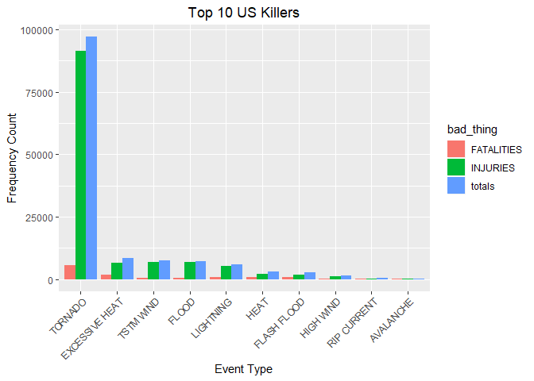
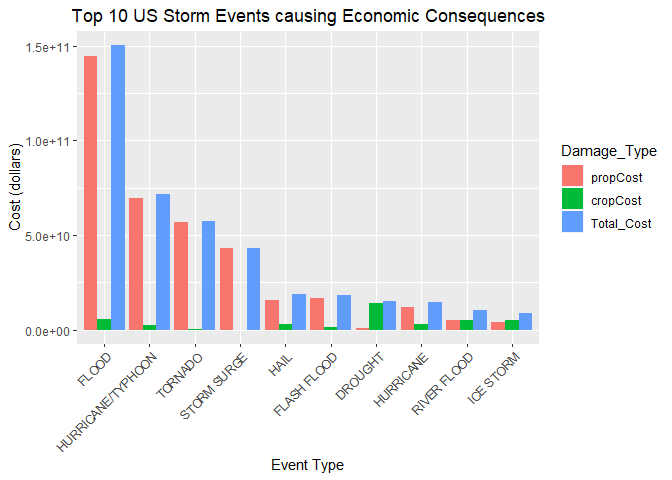

Github repo for the Course: [Reproducible Research](https://github.com/jlalhuber/Reproducible_Research_2)
</br>

## 1: Synopsis
The goal of the assignment is to explore the NOAA Storm Database and explore the effects of severe weather events on both population and economy.The database covers the time period between 1950 and November 2011.

The following analysis investigates which types of severe weather events are most harmful on:

1. Health (injuries and fatalities) 
2. Property and crops (economic consequences)

Information on the Data: [Documentation](https://d396qusza40orc.cloudfront.net/repdata%2Fpeer2_doc%2Fpd01016005curr.pdf)

## 2: Data Processing

### *2.1: Data Loading*

Download the raw data file and extract the data into a dataframe.Then convert to a data.table

```r
library("data.table")
```

```
## Warning: package 'data.table' was built under R version 3.5.2
```

```r
library("ggplot2")
fileUrl <- "https://d396qusza40orc.cloudfront.net/repdata%2Fdata%2FStormData.csv.bz2"
path <- getwd()
download.file(fileUrl, destfile = paste0(path,'/repdata%2Fdata%2FStormData.csv.bz2'))
storm.df <- read.csv("repdata%2Fdata%2FStormData.csv.bz2")
# Converting data.frame to data.table
storm.dt <- as.data.table(storm.df)
```

### *2.2: Examining Data*
Look at column names

```r
colnames(storm.dt)
```

```
##  [1] "STATE__"    "BGN_DATE"   "BGN_TIME"   "TIME_ZONE"  "COUNTY"    
##  [6] "COUNTYNAME" "STATE"      "EVTYPE"     "BGN_RANGE"  "BGN_AZI"   
## [11] "BGN_LOCATI" "END_DATE"   "END_TIME"   "COUNTY_END" "COUNTYENDN"
## [16] "END_RANGE"  "END_AZI"    "END_LOCATI" "LENGTH"     "WIDTH"     
## [21] "F"          "MAG"        "FATALITIES" "INJURIES"   "PROPDMG"   
## [26] "PROPDMGEXP" "CROPDMG"    "CROPDMGEXP" "WFO"        "STATEOFFIC"
## [31] "ZONENAMES"  "LATITUDE"   "LONGITUDE"  "LATITUDE_E" "LONGITUDE_"
## [36] "REMARKS"    "REFNUM"
```

Look at a summary of the data

```r
str(storm.dt)
```

```
## Classes 'data.table' and 'data.frame':	902297 obs. of  37 variables:
##  $ STATE__   : num  1 1 1 1 1 1 1 1 1 1 ...
##  $ BGN_DATE  : Factor w/ 16335 levels "1/1/1966 0:00:00",..: 6523 6523 4242 11116 2224 2224 2260 383 3980 3980 ...
##  $ BGN_TIME  : Factor w/ 3608 levels "00:00:00 AM",..: 272 287 2705 1683 2584 3186 242 1683 3186 3186 ...
##  $ TIME_ZONE : Factor w/ 22 levels "ADT","AKS","AST",..: 7 7 7 7 7 7 7 7 7 7 ...
##  $ COUNTY    : num  97 3 57 89 43 77 9 123 125 57 ...
##  $ COUNTYNAME: Factor w/ 29601 levels "","5NM E OF MACKINAC BRIDGE TO PRESQUE ISLE LT MI",..: 13513 1873 4598 10592 4372 10094 1973 23873 24418 4598 ...
##  $ STATE     : Factor w/ 72 levels "AK","AL","AM",..: 2 2 2 2 2 2 2 2 2 2 ...
##  $ EVTYPE    : Factor w/ 985 levels "   HIGH SURF ADVISORY",..: 834 834 834 834 834 834 834 834 834 834 ...
##  $ BGN_RANGE : num  0 0 0 0 0 0 0 0 0 0 ...
##  $ BGN_AZI   : Factor w/ 35 levels "","  N"," NW",..: 1 1 1 1 1 1 1 1 1 1 ...
##  $ BGN_LOCATI: Factor w/ 54429 levels "","- 1 N Albion",..: 1 1 1 1 1 1 1 1 1 1 ...
##  $ END_DATE  : Factor w/ 6663 levels "","1/1/1993 0:00:00",..: 1 1 1 1 1 1 1 1 1 1 ...
##  $ END_TIME  : Factor w/ 3647 levels ""," 0900CST",..: 1 1 1 1 1 1 1 1 1 1 ...
##  $ COUNTY_END: num  0 0 0 0 0 0 0 0 0 0 ...
##  $ COUNTYENDN: logi  NA NA NA NA NA NA ...
##  $ END_RANGE : num  0 0 0 0 0 0 0 0 0 0 ...
##  $ END_AZI   : Factor w/ 24 levels "","E","ENE","ESE",..: 1 1 1 1 1 1 1 1 1 1 ...
##  $ END_LOCATI: Factor w/ 34506 levels "","- .5 NNW",..: 1 1 1 1 1 1 1 1 1 1 ...
##  $ LENGTH    : num  14 2 0.1 0 0 1.5 1.5 0 3.3 2.3 ...
##  $ WIDTH     : num  100 150 123 100 150 177 33 33 100 100 ...
##  $ F         : int  3 2 2 2 2 2 2 1 3 3 ...
##  $ MAG       : num  0 0 0 0 0 0 0 0 0 0 ...
##  $ FATALITIES: num  0 0 0 0 0 0 0 0 1 0 ...
##  $ INJURIES  : num  15 0 2 2 2 6 1 0 14 0 ...
##  $ PROPDMG   : num  25 2.5 25 2.5 2.5 2.5 2.5 2.5 25 25 ...
##  $ PROPDMGEXP: Factor w/ 19 levels "","-","?","+",..: 17 17 17 17 17 17 17 17 17 17 ...
##  $ CROPDMG   : num  0 0 0 0 0 0 0 0 0 0 ...
##  $ CROPDMGEXP: Factor w/ 9 levels "","?","0","2",..: 1 1 1 1 1 1 1 1 1 1 ...
##  $ WFO       : Factor w/ 542 levels ""," CI","$AC",..: 1 1 1 1 1 1 1 1 1 1 ...
##  $ STATEOFFIC: Factor w/ 250 levels "","ALABAMA, Central",..: 1 1 1 1 1 1 1 1 1 1 ...
##  $ ZONENAMES : Factor w/ 25112 levels "","                                                                                                               "| __truncated__,..: 1 1 1 1 1 1 1 1 1 1 ...
##  $ LATITUDE  : num  3040 3042 3340 3458 3412 ...
##  $ LONGITUDE : num  8812 8755 8742 8626 8642 ...
##  $ LATITUDE_E: num  3051 0 0 0 0 ...
##  $ LONGITUDE_: num  8806 0 0 0 0 ...
##  $ REMARKS   : Factor w/ 436781 levels "","-2 at Deer Park\n",..: 1 1 1 1 1 1 1 1 1 1 ...
##  $ REFNUM    : num  1 2 3 4 5 6 7 8 9 10 ...
##  - attr(*, ".internal.selfref")=<externalptr>
```
### *2.3: Data Subsetting*

Subset the dataset on the parameters of interest by removing the columns we don't need for clarity. 

```r
# Finding columns to remove
cols2Remove <- colnames(storm.dt[, !c("EVTYPE"
  , "FATALITIES"
  , "INJURIES"
  , "PROPDMG"
  , "PROPDMGEXP"
  , "CROPDMG"
  , "CROPDMGEXP")])
# Removing columns
storm.dt[, c(cols2Remove) := NULL]
```

Only use data where fatalities or injuries occurred.  

```r
storm.dt <- storm.dt[(EVTYPE != "?" & 
             (INJURIES > 0 | FATALITIES > 0 | PROPDMG > 0 | CROPDMG > 0)), c("EVTYPE"
                                                                            , "FATALITIES"
                                                                            , "INJURIES"
                                                                            , "PROPDMG"
                                                                            , "PROPDMGEXP"
                                                                            , "CROPDMG"
                                                                            , "CROPDMGEXP") ]
```

### *2.4: Converting Exponent Columns into Actual Exponents instead of (-,+, H, K, etc)*

Making the PROPDMGEXP and CROPDMGEXP columns cleaner so they can be used to calculate property and crop cost.

```r
# Change all damage exponents to uppercase.
cols <- c("PROPDMGEXP", "CROPDMGEXP")
storm.dt[,  (cols) := c(lapply(.SD, toupper)), .SDcols = cols]
# Map property damage alphanumeric exponents to numeric values.
propDmgKey <-  c("\"\"" = 10^0,
                 "-" = 10^0, 
                 "+" = 10^0,
                 "0" = 10^0,
                 "1" = 10^1,
                 "2" = 10^2,
                 "3" = 10^3,
                 "4" = 10^4,
                 "5" = 10^5,
                 "6" = 10^6,
                 "7" = 10^7,
                 "8" = 10^8,
                 "9" = 10^9,
                 "H" = 10^2,
                 "K" = 10^3,
                 "M" = 10^6,
                 "B" = 10^9)
# Map crop damage alphanumeric exponents to numeric values
cropDmgKey <-  c("\"\"" = 10^0,
                "?" = 10^0, 
                "0" = 10^0,
                "K" = 10^3,
                "M" = 10^6,
                "B" = 10^9)
storm.dt[, PROPDMGEXP := propDmgKey[as.character(storm.dt[,PROPDMGEXP])]]
storm.dt[is.na(PROPDMGEXP), PROPDMGEXP := 10^0 ]
storm.dt[, CROPDMGEXP := cropDmgKey[as.character(storm.dt[,CROPDMGEXP])] ]
storm.dt[is.na(CROPDMGEXP), CROPDMGEXP := 10^0 ]
```

### *2.5: Making Economic Cost Columns*
Create for total Property Cost and Crop Cost for each row of data

```r
storm.dt <- storm.dt[, .(EVTYPE, FATALITIES, INJURIES, PROPDMG, PROPDMGEXP, propCost = PROPDMG * PROPDMGEXP, CROPDMG, CROPDMGEXP, cropCost = CROPDMG * CROPDMGEXP)]
```

### *2.6: Calcuating Total Property and Crop Cost*
Create summary of Total Property and Crop Cost by EVTYPE

```r
totalCost.dt <- storm.dt[, .(propCost = sum(propCost), cropCost = sum(cropCost), Total_Cost = sum(propCost) + sum(cropCost)), by = .(EVTYPE)]
totalCost.dt <- totalCost.dt[order(-Total_Cost), ]
totalCost.dt <- totalCost.dt[1:10, ]
print(totalCost.dt)
```

```
##                EVTYPE     propCost    cropCost   Total_Cost
##  1:             FLOOD 144657709807  5661968450 150319678257
##  2: HURRICANE/TYPHOON  69305840000  2607872800  71913712800
##  3:           TORNADO  56947380677   414953270  57362333947
##  4:       STORM SURGE  43323536000        5000  43323541000
##  5:              HAIL  15735267513  3025954473  18761221986
##  6:       FLASH FLOOD  16822673979  1421317100  18243991079
##  7:           DROUGHT   1046106000 13972566000  15018672000
##  8:         HURRICANE  11868319010  2741910000  14610229010
##  9:       RIVER FLOOD   5118945500  5029459000  10148404500
## 10:         ICE STORM   3944927860  5022113500   8967041360
```

### *2.7: Calcuating Total Fatalities and Injuries*
Create summary of Total Fatalities and Injuries by EVTYPE

```r
totalInjuries.dt <- storm.dt[, .(FATALITIES = sum(FATALITIES), INJURIES = sum(INJURIES), totals = sum(FATALITIES) + sum(INJURIES)), by = .(EVTYPE)]
totalInjuries.dt <- totalInjuries.dt[order(-FATALITIES), ]
totalInjuries.dt <- totalInjuries.dt[1:10, ]
print(totalInjuries.dt)
```

```
##             EVTYPE FATALITIES INJURIES totals
##  1:        TORNADO       5633    91346  96979
##  2: EXCESSIVE HEAT       1903     6525   8428
##  3:    FLASH FLOOD        978     1777   2755
##  4:           HEAT        937     2100   3037
##  5:      LIGHTNING        816     5230   6046
##  6:      TSTM WIND        504     6957   7461
##  7:          FLOOD        470     6789   7259
##  8:    RIP CURRENT        368      232    600
##  9:      HIGH WIND        248     1137   1385
## 10:      AVALANCHE        224      170    394
```

## 3: Results

### *3.1: Events that are Most Harmful to Population Health*

Melting data.table so that it is easier to put in bar graph format 

```r
bad_stuff <- melt(totalInjuries.dt, id.vars="EVTYPE", variable.name = "bad_thing")
head(bad_stuff, 5)
```

```
##            EVTYPE  bad_thing value
## 1:        TORNADO FATALITIES  5633
## 2: EXCESSIVE HEAT FATALITIES  1903
## 3:    FLASH FLOOD FATALITIES   978
## 4:           HEAT FATALITIES   937
## 5:      LIGHTNING FATALITIES   816
```


```r
# Create chart
healthChart <- ggplot(bad_stuff, aes(x=reorder(EVTYPE, -value), y=value))
# Plot data as bar chart
healthChart = healthChart + geom_bar(stat="identity", aes(fill=bad_thing), position="dodge")
# Format y-axis scale and set y-axis label
healthChart = healthChart + ylab("Frequency Count") 
# Set x-axis label
healthChart = healthChart + xlab("Event Type") 
# Rotate x-axis tick labels 
healthChart = healthChart + theme(axis.text.x = element_text(angle=45, hjust=1))
# Set chart title and center it
healthChart = healthChart + ggtitle("Top 10 US Killers") + theme(plot.title = element_text(hjust = 0.5))
healthChart
```

<!-- -->

### *3.2: Events that have the Greatest Economic Consequences*

Melting data.table so that it is easier to put in bar graph format 

```r
econ_consequences <- melt(totalCost.dt, id.vars="EVTYPE", variable.name = "Damage_Type")
head(econ_consequences, 5)
```

```
##               EVTYPE Damage_Type        value
## 1:             FLOOD    propCost 144657709807
## 2: HURRICANE/TYPHOON    propCost  69305840000
## 3:           TORNADO    propCost  56947380677
## 4:       STORM SURGE    propCost  43323536000
## 5:              HAIL    propCost  15735267513
```


```r
# Create chart
econChart <- ggplot(econ_consequences, aes(x=reorder(EVTYPE, -value), y=value))
# Plot data as bar chart
econChart = econChart + geom_bar(stat="identity", aes(fill=Damage_Type), position="dodge")
# Format y-axis scale and set y-axis label
econChart = econChart + ylab("Cost (dollars)") 
# Set x-axis label
econChart = econChart + xlab("Event Type") 
# Rotate x-axis tick labels 
econChart = econChart + theme(axis.text.x = element_text(angle=45, hjust=1))
# Set chart title and center it
econChart = econChart + ggtitle("Top 10 US Storm Events causing Economic Consequences") + theme(plot.title = element_text(hjust = 0.5))
econChart
```

<!-- -->
